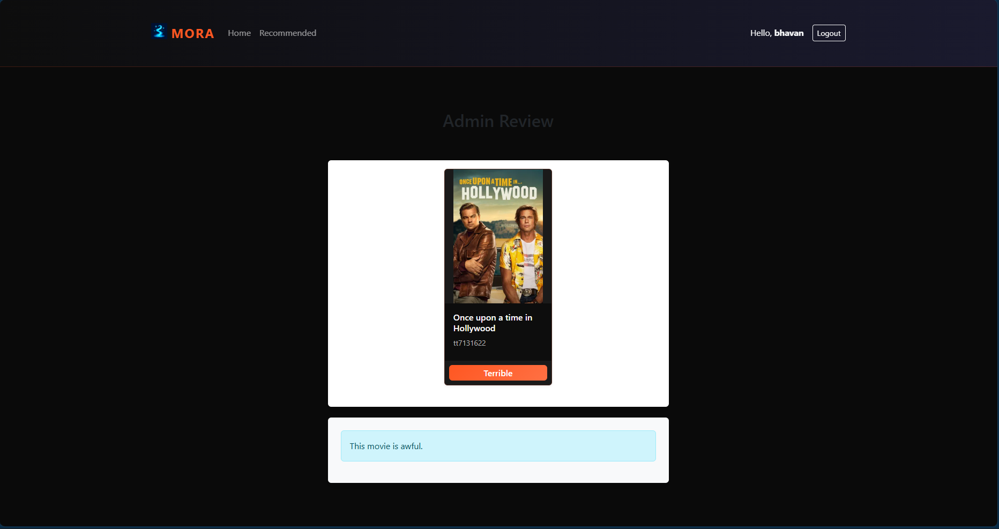

# MORA — Streaming Demo

MORA is a full-stack movie streaming demo with AI-powered recommendations. It combines a React frontend, a Go + Gin backend, and MongoDB for storage. The frontend embeds YouTube trailers for playback and provides a dark, streaming-style UI.

---

## About

This repository demonstrates a compact streaming application built for demo and learning purposes. It includes:

- A React + Vite client with a dark streaming UI.
- A Go backend using Gin that exposes movie and user APIs.
- MongoDB for movie and user storage.
- Integration with OpenAI (optional) for AI-driven review ranking.

---

## Features

- Browse movies with poster cards and play trailers
- Admin review flow with AI ranking integration
- User authentication (register/login)
- Recommended movies based on user favourite genres
- Responsive, modern UI with animated cards and thumbnails

---

## Screenshots

Place your screenshot images inside the `screenshot/` folder at the project root (create it if it doesn't exist). The README references these files:

- `screenshot/signin.png` — sign in screen
- `screenshot/grid.png` — main movies grid
- `screenshot/review.png` — admin review modal/page
- `screenshot/stream.png` — stream player view

Example gallery (these image files should exist in the `screenshot/` folder):





If you uploaded different image names, either rename them or update the image paths above.

---

## Tech Stack

| Component | Technology |
|---|---|
| Frontend | React, Vite, Bootstrap, React Player |
| Backend | Go, Gin |
| Database | MongoDB |

---

## Quick Start (development)

1. Backend

```powershell
cd Server/MagicStreamServer
# copy .env.example to .env and edit the values
cp .env.example .env
go run main.go
```

Default backend port is `8080`. You can change it by setting `PORT` in `.env` or in your environment.

2. Frontend

```powershell
cd Client/magic-stream-client
npm install
npm run dev
```

The frontend runs on Vite (default `http://localhost:5173` or available alternate port). If Vite picks another port (e.g. `5174`) the app will still call the backend at the URL configured in the client env.

---

## Environment Variables

See `Server/MagicStreamServer/.env.example` and `Client/magic-stream-client/.env.example` for the variables used in each app. Important ones:

- `MONGODB_URI` — MongoDB connection string
- `DATABASE_NAME` — database name (example: `MORA-stream-Movies`)
- `OPENAI_API_KEY` — (optional) for AI review ranking
- `VITE_API_URL` (client) — backend URL (e.g. `http://localhost:8080`)

---

## How YouTube Trailers are Played

Trailers are embedded using `react-player` and the `youtube_id` stored on each movie document. The stream route uses the pattern `/stream/:yt_id` and the player loads `https://www.youtube.com/watch?v=<yt_id>`.

Important: Do not download or redistribute YouTube content — the app embeds the official YouTube player.

---

## Contributing

If you'd like to contribute, please open issues or pull requests. To add screenshots to this README, add files to the `screenshot/` folder and commit them.

---

## License

This project is for demonstration purposes. Replace with your preferred license if you plan to publish.
